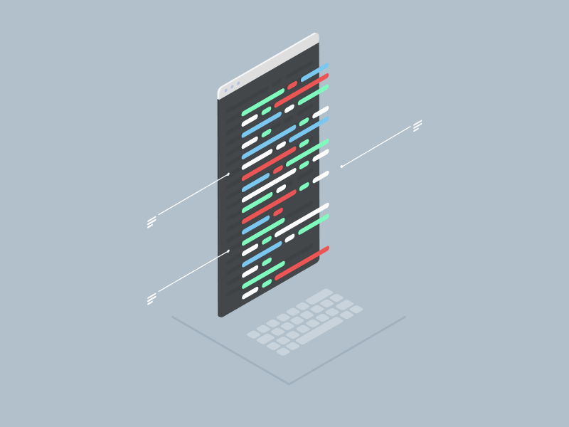

<h1 align="center">
    
</h1>
<h3 align="center">A passionate frontend developer from Iran</h3>

  

- 🌱 I’m currently learning **React.js, Node.js and MongoDB**

- 👨‍💻 My portfolio is available at [https://pouyarahmani.github.io/Introduction/](https://pouyarahmani.github.io/Introduction/)

- 💬 Ask me about **React and JavaScript**

- 📫 How to reach me **r.pouya84@gmail.com**

- ⚡ Fun fact **I am Funny and Outgoing**

 
  
  
  <a href="https://pouyarahmani.github.io/Introduction/" target="_blank">
      <!-- sqlite, safari, google-chrome are other good icon options -->
  </a>

 
<h3 align="left">Connect with me:</h3>

<h2 align="left">Languages and Tools:</h2>

     
     
    

 

  <h2>🐍 My Contributions 🐍</h2>
   
 
  
     

    <h2>Stats:</h2> 

      
  
  
   

